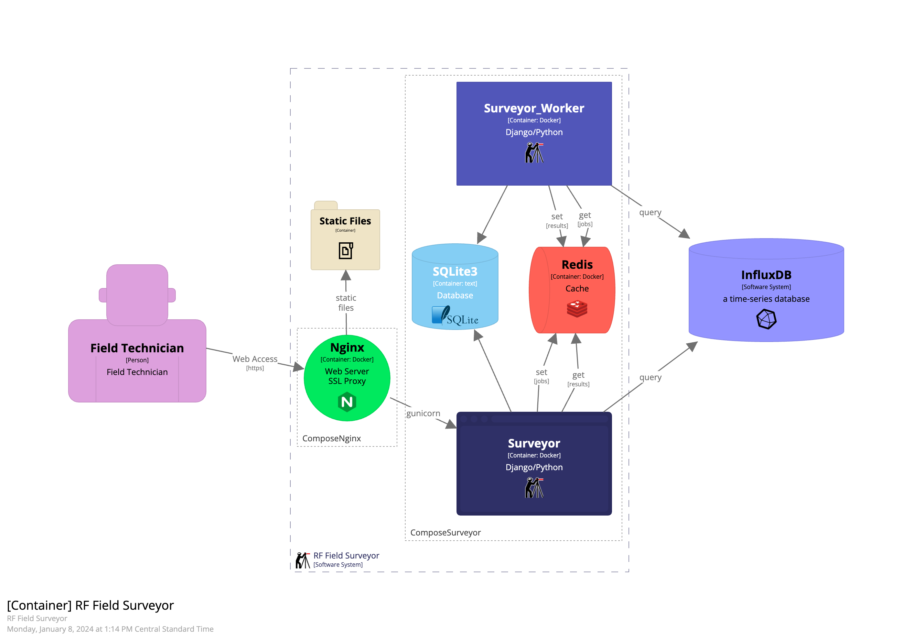

# Surveyor

The RF Field Surveyor (aka Surveyor) is a Python (Django) web application used to present RF (Radio Frequency) performance data, as stored in an InfluxDB Time-series Database (TSDB).

## Surveyor Component Diagram

What is Surveyor?

* Surveyor: Docker - a Docker Container running Surveyor to provide web access to RF Peformance historical data.
* Surveyor_Workder - a Docker Container running Surveyor that handles long running tasks.
* Redis - a caching system for sharing jobs (tasks) and results.



## Deployment

**Note:** Under (continual) revision...

After deployment of a suitable WebHost (typically NGINX).

* git clone [https://github.com/sheeriot/surveyor.git](https://github.com/sheeriot/surveyor.git)
* setup application `env/django.env`
* define docker-compose `.env`
* create softlink (`ln -s`) to docker-override for environment
* startup with `docker-compose up`

## Setup DNS CNAME Records for Two SSL Certificates

The Django startup code will enable two host names.

Create a django.env file in the `surveyor/env` folder.

```bash
> `cd surveyor/env`

> `cp django-sample.env django.env`

> `vi django.env`
```

Set two hostnames in the `django.env` file that the Django server will permit for system access. e.g. surveyor.name.one surveyor2.name.ns

This name used should match the DNS name setup for this host.

Note: The (SSL) Certbot and NGINX server is setup in the companion repository: **webhost**.

## Docker Compose for Service Management

Docker-compose is the best (single computer) method to run docker containers as services on linux VMs.

Docker-compose requires two setup files:

* create the docker-compose `.env` file
  * `cp compose.env-sample .env`
  * `vi .env` # << set the COMPOSE_PROJECT_NAME and TCP_PORT
* softlink the intended docker-compose override file:
  * `ln -s docker-compose-prod.override.yml docker-compose.override.yml`

Your server should now be ready to start.

### Docker-Compose Container Operations

Use `docker-compose up/down (-d)` and other docker-compose commands to manage the containers.

### Disclaimer Web Access - YO-YO - you are on your own

By default, the surveyor web app is available behind the NGINX web frontend. Adjust your web access systems as needed.

Take approprite precautions to protect your website from internet abuse. Keep passwords strong and private.

## After Startup

Access the web page and the admin console (/admin).

The Admin URL:

* `https://mysurveyor.domain.name/admin`
