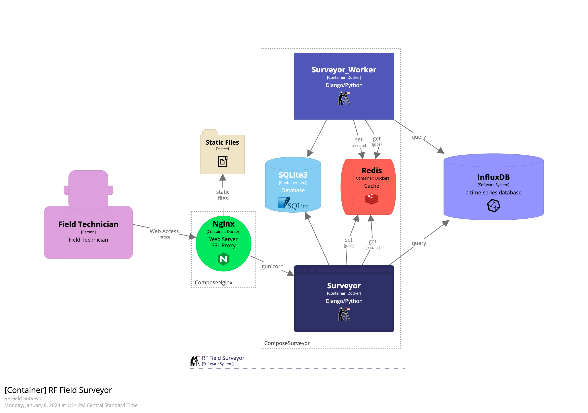

# Surveyor

The RF Field Surveyor (aka **Surveyor**) is a Python (Django) web application used to present RF (Radio Frequency) performance data stored in an InfluxDB Time-series Database (TSDB).

Surveyor is typically deployed using Docker containers and provides historical insight into RF network performance.

---

## License

This project is released under **The Unlicense**.

Use it freely, fork it, include it in products, or modify it as needed.

See the full license:

[LICENSE.md](LICENSE.md)

---

## Surveyor Component Diagram

What is Surveyor?

Surveyor is composed of several cooperating services.

**Surveyor**  
Docker container running the Django web application providing web access to RF performance historical data.

**Surveyor Worker**  
Docker container responsible for long running tasks.

**Redis**  
Caching and task coordination system used to share jobs and results.

---

## High Level Operation

Typical deployment flow:

InfluxDB (RF metrics)
        │
        ▼
Surveyor Worker
        │
        ▼
      Redis
        │
        ▼
   Surveyor Web
        │
        ▼
      NGINX
        │
        ▼
      Users

Surveyor reads RF performance data stored in InfluxDB and presents it through a web interface for inspection and historical analysis.

---

## Repository Layout

surveyor/        Django application  
env/             environment configuration  
README/          diagrams and documentation assets  
docker-compose   container orchestration  

---

## Setup

Deployment and configuration instructions are located in:

[SETUP.md](SETUP.md)

---

## Operational Notes

This software is provided without operational guarantees.

Operators are responsible for securing deployments and managing internet exposure of services.
