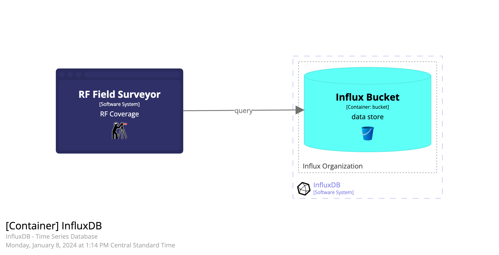

# this heading ignored

RF Field Surveyor (aka Surveyor) is a Django (python) web application.

## Overview

### Missed Uplinks

Tracking uplinks and gaps in the Uplink Frame Counter are used to derive a Packet Delivery Ratio (PDR).

Weak received signals strength indication (RSSI) and low Signal-to-Noise Ratio (SNR) will result in more missed frames (uplinks). SNR and RSSI is also reported by the gateway and can provide interesting data for analysis.

Ultimately it is the PDR (Packet Delivery Ratio) that matters most. Determin how the the application deals with missing messages. Device-side repetition, downlink initiated request? Is the device using LoRaWAN "confirmed" frames? Does the device expect an Ack? Will the server solicit a payload (via custom Downlink message to device?)

For example, the histogram below shows too many devices performing poorly (low PDR) over a one (1) week period.

### Software System Diagram

This site also documents the Surveyor software application. This diagram provides an overview of the parts of the RF Field Surveyor.

#### InfluxDB Data Source

The Surveyor currently uses an InfluxDB as the source for all queries and reports.

InfluxDB uses an "Organization" to provide multi-tenancy.

Within the InfluxDB **Organzation**, Measurements tables are stored in Buckets (database).

To use Surveyor, you will need setup and/or provide access to Influx Sources. This is only available to Admin users.
