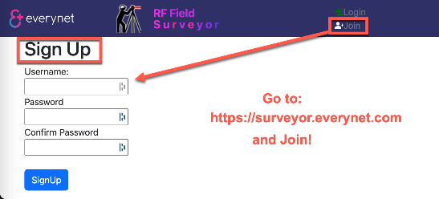
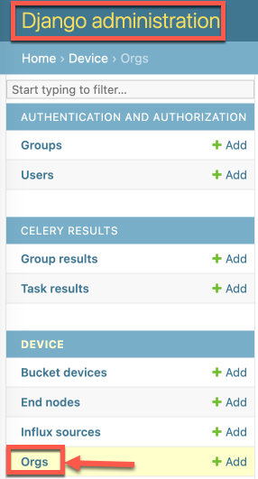
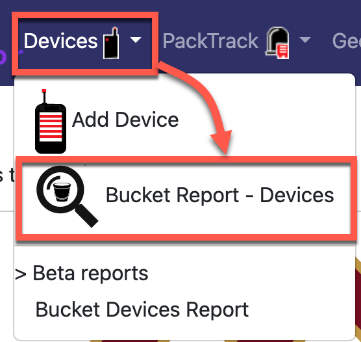

# Surveyor Chapter 2 - QuickStart

## User Startup

The intention of this section is to get a new user online and using the RF Field Surveyor (aka Surveyor) web application.

### Join Surveyor

Visit the Surveyor home page:
* [https://surveyor.everynet.com]()

To create a new account, use the "Join" button in the right of the top banner.

After your user account is created, use the Login/Logout button (in top banner right) to access the application.

### Surveyor Orgs

The Surveyor application uses "Organizations" to group administrative domains. This provides a "multi-tenancy" on the single platform.

Goal:

You should only be able to see devices data from your own "surveyor organization" devices and sources.

**Note:** New users will need to be explicitly added to the correct Organzations using Django admin pages.

### Django Admin Pages

Administrators of the deployed Surveyor are able to login to the application admin pages where you can add users to Organizations, create new Influx Sources, add and modify devices and related operations.

Surveyor Admin URL:
- [https://surveyor.everynet.com/admin]()

As an administrator, you can add users to Organizations. This is a needed step for new users.

### Device vs. Bucket Reports

The Surveyor currently offers two distinct report types:

- **single device reports**
  - **packtrack** - a frame history
  - **climatewan** - temp, humidity, battery
  - **geowan** - mobile device location tracking by payload

- **bucket reports**
  - collects and analyzes a full influxDB measurement (table), multiple devices.

  

### Organizations

Note that all of the following have their own Organzation construct to enable multi-tenancy:
- Everynet Network Server - uses Organzations for administrative domains
- InfluxDB - uses Organizations for administrative domains
- Surveyor - uses Organizations for administrative domains

Note that these Organizations on each system are distinct and seperate. They each are intending to enable the same design function, partitioned user groups.
