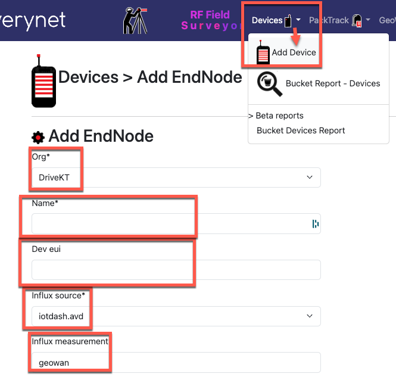
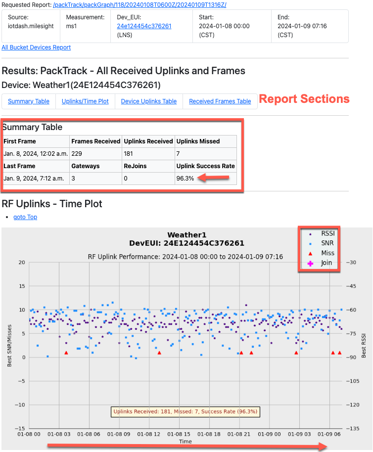
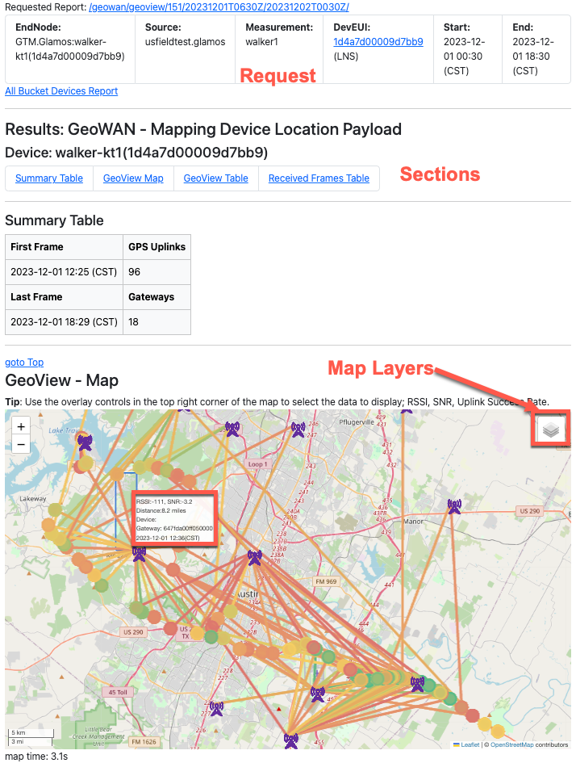
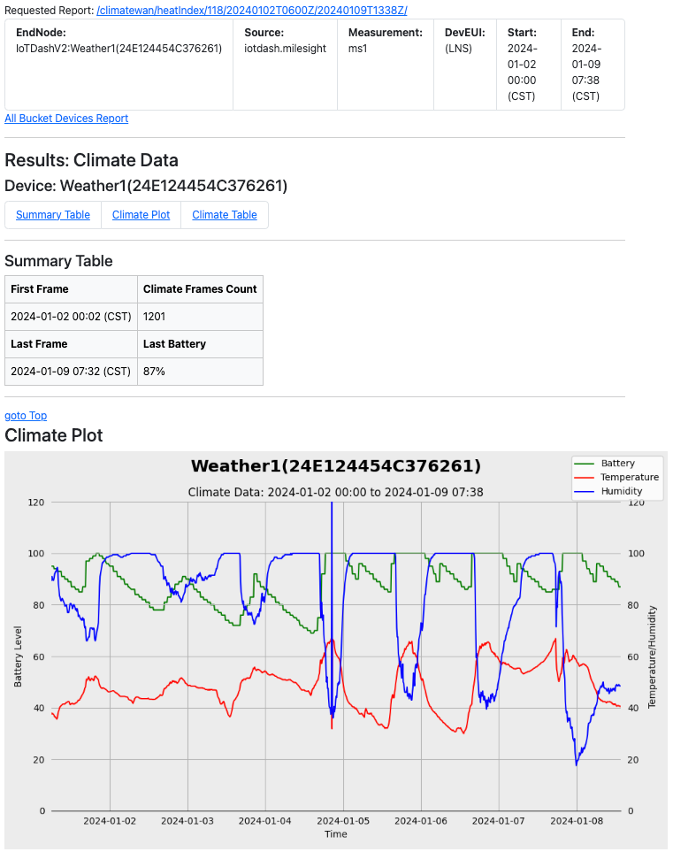

# Device Reports Section

## Single Device Reports

There are three report areas (with one report each) available for single devices.

To use the Single Device reports, the device will need to be added to the Surveyor database.

Be sure to put in the correct DevEUI, set a name, select your Org and Source.

**Dev Note:** Source Choices should be scoped to Selected Org.

### PackTrack

This section provides a single report page for one device, PackGraph.
- **Note:** The device must first be added as an End-Node to an InfluxDB Source.

Use the PackGraph scatter-plot to track device history.

In this example, a Milesight Weather Station history is examined. You can see the RSSI and SNR are both very strong. A few uplinks are missed, and a packet delivery rate is provided (96.3%) for the reported time period.

The X-Axis is a time plot, the Y-Axis shows "best" RSSI and SNR for each uplink, miss indications and counts, and re-join markers.

### GeoWAN

GeoWAN is intended to support mobile devices with GPS Payloads. This report can be used to perform a "Drive Test", although you might want to walk.

This section provides a single report page for one device, GeoView.
- **Note:** The device must first be added as an End-Node to an InfluxDB Source. The "GPS Payload" checkbox must be selected, and the device GPS payload data must be saved in InfluxDB (lat/long).

### ClimateWAN

The ClimateWAN section provides a HeatIndex report. It does NOT calculate Heat Index, just a report name :)

This page reports the following field values if found:
- temperature (stored in Celsius, presented in Fahrenheit)
- humidity
- battery_level (%) or battery_voltage

Here is a sample of the HeatIndex page output a one week report on the Milesight Weather Station.

